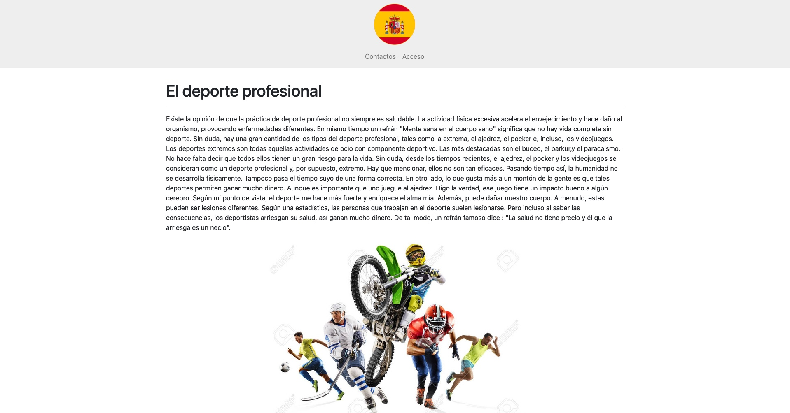
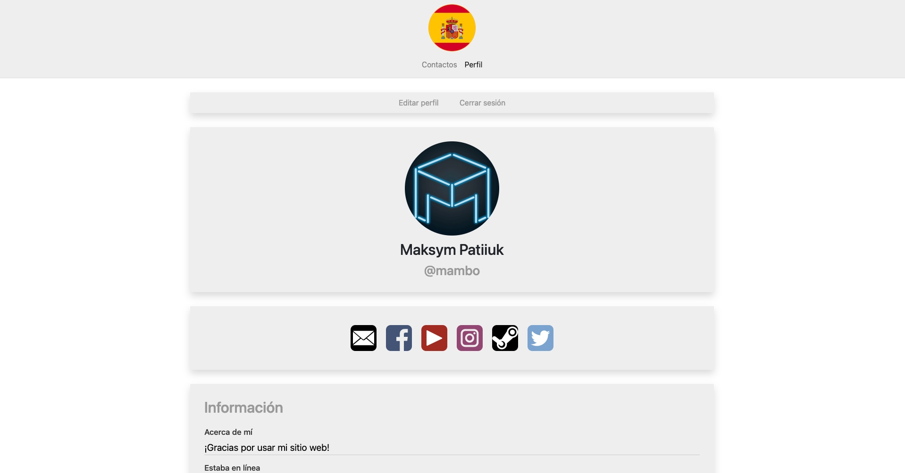
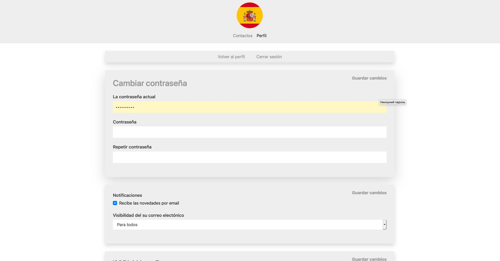
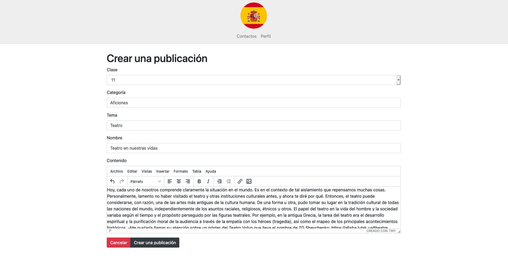
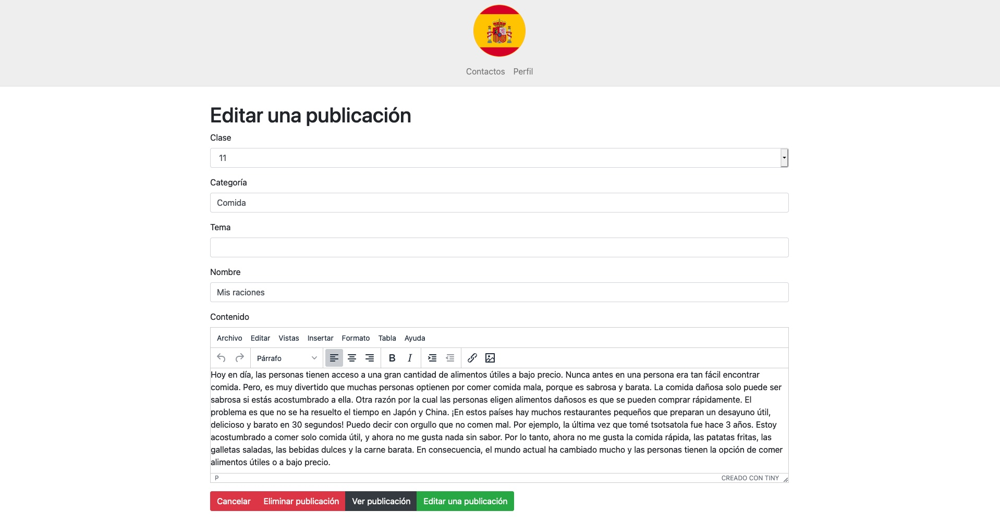

# espanol.zzz.com.ua

The second generation of the  website for e-Submission of Homework
assignments from the Spanish Language classes.

It was created arround 2019.

I used a previous version of this website in 2018 to win the first
place in the All-Ukrainian competition on information technologies
"iTalent" in the nomination "Web Development".

## Configuration

* Install PHP 7.4. No external dependencies needed
* Upload the database from `database.sql` onto your MySQL server.
  Alternatively, you can use `database_with_some_data.sql` that is the
  latest backup of the production version, but witohut personal user
  data or log entries.
* Put your database credentials in components/Sql.php
* Various configuration options and localization files are located in
  the `./config/` directory.
* Configure nginx to server the website

## Screenshots

