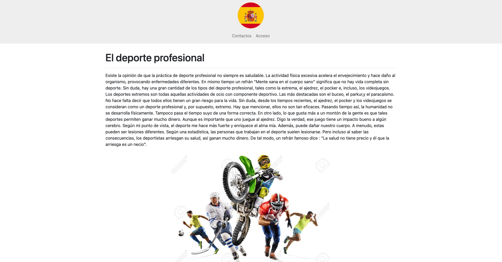

# espanol.zzz.com.ua

A website for e-Submission of Homework assignments from the Spanish Language
classes.

It was managed between 2017 and 2019

I used the first version of this website in 2017 to [win the first
place in the All-Ukrainian competition
](https://drive.google.com/file/d/1GJm1lk5NuufC8vPcCYAYQDg-ItTr-Mdn/view?usp=sharing) in information technologies
"iTalent" in the nomination "Web Development".

## Features

- Full in-house implementation of the authentication system:
    - Login
    - Register
    - Password recovery (with confirmation emails)
    - Email change (with confirmation and revert emails)
    - Public student and teacher profiles
    - Ability to change visiblity for parts of the profile
    - Ability to see list of registered users, their profiles and
      recent activity
    - Teacher accounts and "invisible accounts"
    - Teacher can edit or ban users

- UI is localized in Spanish. Clicking on any non-interactive element
  changes that element to Ukrainian. For interactive elements, the
  translation is provided in mouseover messages.

- Registered users can create a new post (i.e. a Homework assignment).
  Post can also contain multiple-choice questions with automatic
  grading.

  Afterward, professor receives an email notification to grade the
  post and make grammatical corrections. Professor can also return
  the homework without grading, which means it needs to be redone.

  AFter grading, student gets an email and can see which
  corrections were made. Student can make neccessary corrections and
  send the homework for regrading.

- Graded posts are publicly visible to all users. The number of views
  is also visible.

- There is a leaderbord that ranks all students by their total grade.

## V2

### Configuration

* Install PHP 7.4. No external dependencies needed
* Upload the database from `database.sql` onto your MySQL server.
  Alternatively, you can use `database_with_some_data.sql` - the
  latest backup of the production version, but without personal user
  data or log entries.
* Put your database credentials in components/Sql.php
* Various configuration options and localization files are located in
  the `./config/` directory.
* Configure nginx to serve the website

### Screenshots

