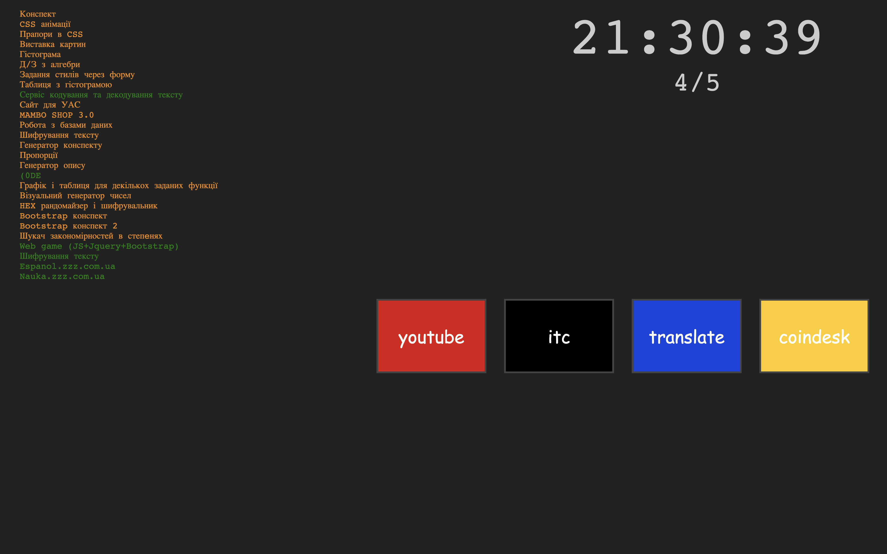
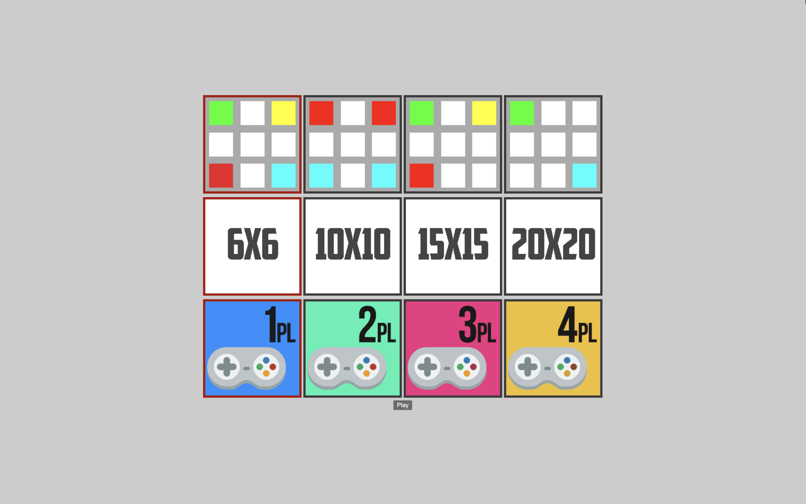

# Map

This was used as my browser home page, and as my portfolio at the same time
(on someone's computer I could just open this one page and have easy links to
all the other projects).

## Game

I found my brothers playing a game on their phone and decided to implement
it in JavaScript and PHP. [Chain Reaction](https://play.google.com/store/apps/details?id=com.BuddyMattEnt.ChainReaction&hl=en_IN)
might have been the one. My implementation allowed for 1-4 players, different
board sizes and even had an AI you could play against!

[Source code](./files/d3_19.php)

